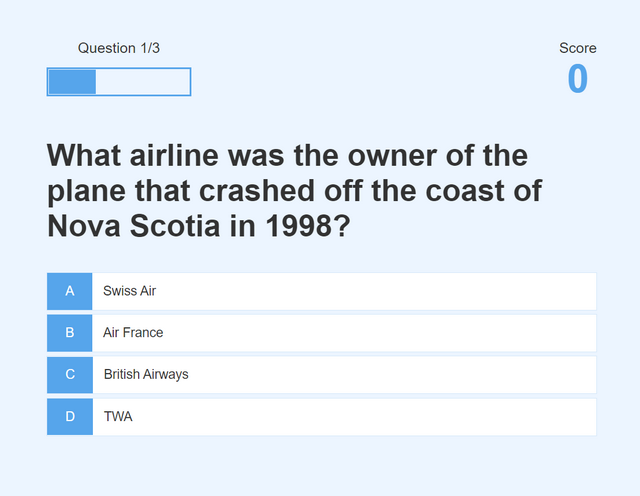

# Quiz Game based on classic HTML, CSS, and Javascript

[See Application here](https://quiz-app-3questions.herokuapp.com/highscores.html)

# Resources

- [Emmet in Visual Studio Code](https://www.youtube.com/watch?v=5guZjNDcVnA)
- [Understanding REM Units](https://www.sitepoint.com/understanding-and-using-rem-units-in-css/)
- [A Complete Guide to Flexbox](https://css-tricks.com/snippets/css/a-guide-to-flexbox/)

- [Creating Code Snippets in Visual Studio Code](https://www.youtube.com/watch?v=K3gLlZm-m_8)
- [Using Data Attributes](https://developer.mozilla.org/en-US/docs/Learn/HTML/Howto/Use_data_attributes)
- [Document Query Selector](https://developer.mozilla.org/en-US/docs/Web/API/Document_object_model/Locating_DOM_elements_using_selectors)
- [Document Get by ID](https://developer.mozilla.org/en-US/docs/Web/API/Document/getElementById)
- [Spread Operator](https://developer.mozilla.org/en-US/docs/Web/JavaScript/Reference/Operators/Spread_syntax)
- [Arrow Functions](https://developer.mozilla.org/en-US/docs/Web/JavaScript/Reference/Functions/Arrow_functions)

- [Bootstrap 4 Colors](https://www.w3schools.com/bootstrap4/bootstrap_colors.asp)
- [Triple vs Double Equals](https://codeburst.io/javascript-double-equals-vs-triple-equals-61d4ce5a121a)

- [ES6 Template Literals](https://developer.mozilla.org/en-US/docs/Web/JavaScript/Reference/Template_literals)

- [Local Storage](https://www.w3schools.com/jsref/prop_win_localstorage.asp)

- [Local Storage](https://www.w3schools.com/jsref/prop_win_localstorage.asp)

- [JSON Parse and Stringify](https://alligator.io/js/json-parse-stringify/)
- [Array Sort](https://www.w3schools.com/js/js_array_sort.asp)
- [Array Map](https://www.w3schools.com/jsref/jsref_map.asp)
- [Array Join](https://developer.mozilla.org/en-US/docs/Web/JavaScript/Reference/Global_Objects/Array/join)

- [How to Use the Fetch API](https://scotch.io/tutorials/how-to-use-the-javascript-fetch-api-to-get-data)
- [Promises](https://developer.mozilla.org/en-US/docs/Web/JavaScript/Reference/Global_Objects/Promise_)

- [How to Use the Fetch API](https://scotch.io/tutorials/how-to-use-the-javascript-fetch-api-to-get-data)
- [Open Trivia DB](https://opentdb.com/)
- [Array Map](https://www.w3schools.com/jsref/jsref_map.asp)
- [Array For Each](https://www.w3schools.com/jsref/jsref_foreach.asp)

- [Create a CSS Loader](https://www.w3schools.com/howto/howto_css_loader.asp)

## Setup Notes

To run in Heroku HTML must be associated with a build

> touch composer.json
> add the following line: {}
> touch index.php
> add the following line: : <?php include_once("index.html"); ?>

Now, commit and push these two new files to your repository. You can also use the Heroku command git push heroku master

## Git commands

- > git init QuizApp
- > cd QuizApp
- > git pull https://github.com/billjenner/QuizApp.git
- > git remote add origin https://github.com/billjenner/QuizApp.git
- > git push origin master

- > heroku login
- > heroku git:remote -a quiz-app-3questions
- > git branch -r
- > git show-ref
- > git push Heroku master

### Debug local Storage

> Chrome
> F12 (dev tools)
> Application
> Local Storage

Local Storage only uses key/Value pairs with any value as string

### Using Local Storage

localStorage.getItem('highScores', JSON.stringify([]));
console.log(JSON.parse(localStorage.getItem('highScores')));

### Implicite Return

If b > a, return b, otherwise return a
highScores.sort((a, b) => b.score - a.score);

### debug dymanic js

console.log(
highScores
.map((score) => {
return `<li class="high-score">${score.name}-${score.score}</li>`;
})
.join('')
);

### dymanic js much like React

highScoresList.innerHTML = highScores
.map((score) => {
return `<li class="high-score">${score.name}-${score.score}</li>`;
})
.join('');

### Open Trivia DB

- [Public DB of trvia questions](https://opentdb.com)

### Class Reference:

- [Class Reference](https://www.udemy.com/course/build-a-quiz-app-with-html-css-and-javascript/)
